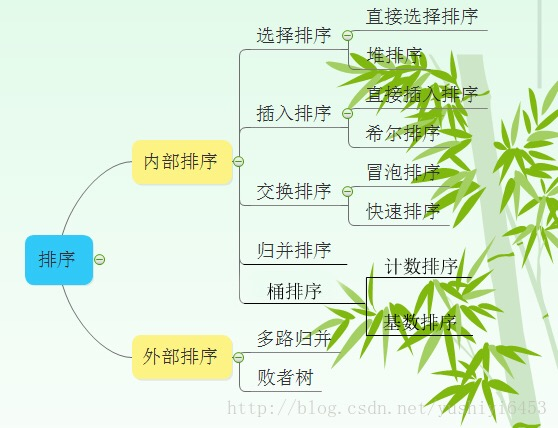

[bubblesort]: ./assets/BubbleSort.gif
[sortmind]: ./assets/sortMind.jpg
[sortcomplexity]: ./assets/sortTimeSpaceComplexity.png
[selectsort]: ./assets/SelectSort.gif
[insertsort]: ./assets/InsertSort.gif
[mergesort]: ./assets/MergeSort.gif
[quicksort]: ./assets/QuickSort.gif
[heapsort]: ./assets/HeapSort.gif
[heapsort2]: ./assets/HeapSort2.gif
[heapsort3]: ./assets/HeapSort3.gif
[hashsort]: ./assets/HashSort.gif

# 排序算法


:::: code-group

::: code-group-item 分类



:::


::: code-group-item 时间和空间复杂性
![sortComplexity]
:::


::: code-group-item 记忆

```
- 时间复杂度记忆-
- 冒泡、选择、直接 排序需要两个 for 循环，每次只关注一个元素，平均时间复杂度为 O(n\*2)（一遍找元素 O(n)，一遍找位置 O(n）)
- 快速、归并、希尔、堆基于二分思想，log 以 2 为底，平均时间复杂度为 O(nlogn)（一遍找元素 O(n)，一遍找位置 O(nlogn))
- 稳定性记忆-“快希选堆”（快牺牲稳定性）
- 排序算法的稳定性：排序前后相同元素的相对位置不变，则称排序算法是稳定的 0；否则排序算法是不稳定的。
```

:::
::::


## 冒泡排序

::: tip
前后两个之间比较并排序（1:1）
:::
![BubbleSort]

::: details code

```Python
def bubble_sort(arr):
    for i in range(len(arr)-1, 0, -1):
        for j in range(i):
            if arr[j] > arr[j+1]:
                arr[j], arr[j+1] = arr[j+1], arr[j]

```

:::


## 选择排序

::: tip
遍历全部后一个一个比较排序（1:全部）
:::
![SelectSort]

::: details code

```python
def select_sort(arr):
    for k in range(len(arr)):
        m = k
        for j in range(k + 1, len(arr)):
            if arr[m] > arr[j]:
                m = j
        arr[k], arr[m] = arr[m], arr[k]

```

:::

## 插入排序

![InsertSort]

## 归并排序

![MergeSort]

## 快速排序

::: tip
快速排序从小到大排序：在数组中随机选一个数（默认数组首个元素），数组中小于等于此数的放在左边，大于此数的放在右边，再对数组两边递归调用快速排序，重复这个过程
:::

![QuickSort]

::::: details 快速排序Code

:::: code-group

::: code-group-item Python

```python
from random import randint

def quicksort(arr, l, r):
    if l < r:
        p = randint(l, r)
        arr[r], arr[p] = arr[p], arr[r]
        k = partition(arr, l, r)
        quicksort(arr, l, k-1)
        quicksort(arr, k+1, r)

def partition(arr, l, r):
    m = l -1
    for i in range(l, r):
        if arr[i] < arr[r]:
            m += 1
            arr[m], arr[i] = arr[i], arr[m]
    arr[m+1], arr[r] = arr[r], arr[m+1]
    return m + 1

if __name__ == '__main__':
    nums = [7, 2, 15, 1, 11, 5, 9]
    quicksort(nums, 0, len(nums)-1)
    print(nums)
    # Output: [1, 2, 5, 7, 9, 11, 15]
```

:::

::: code-group-item C
```cpp
#快速排序
//接口调整
void adjust_quicksort(int k[],int n)
{
   quicksort(k,0,n-1);
}
void quicksort(int a[], int left, int right)
{
    int i,j,t,temp;
    if(left>right)   //（递归过程先写结束条件）
       return;

    temp=a[left]; //temp中存的就是基准数
    i=left;
    j=right;
    while(i!=j)
    {
        //顺序很重要，要先从右边开始找（最后交换基准时换过去的数要保证比基准小，因为基准
        //选取数组第一个数，在小数堆中）
        while(a[j]>=temp && i<j)
                j--;
        //再找右边的
        while(a[i]<=temp && i<j)
                i++;
        //交换两个数在数组中的位置
        if(i<j)
        {
                t=a[i];
                a[i]=a[j];
                a[j]=t;
        }
    }
    //最终将基准数归位 （之前已经temp=a[left]过了，交换只需要再进行两步）
    a[left]=a[i];
    a[i]=temp;

    quicksort(left,i-1);//继续处理左边的，这里是一个递归的过程
    quicksort(i+1,right);//继续处理右边的 ，这里是一个递归的过程
}
```

:::
::::
:::::

## 堆排序

![HeapSort]
![HeapSort2]
![HeapSort3]

## 哈希排序

![HashSort]
