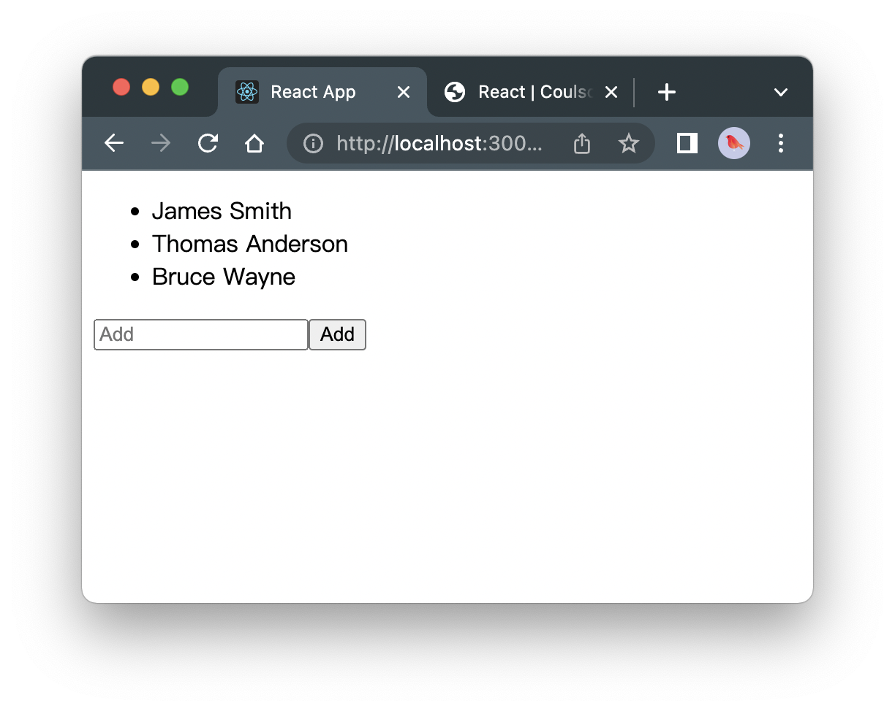

# React

## 快速开始 ？

```sh
yarn
yarn start
```

```sh
yarn add react-icons
yarn add -D sass
yarn add --dev typescript @types/react @types/node
```

## React快速入门

* 创建一个新的React项目

```shell
npx create-react-app react-app
```


* React项目结构

::: details 查看React项目结构

```md
$ tree
.
├── node_modules
├── src
│    ├── `components`
│    │   └── Navbar.jsx
│    ├── App.css
│    ├── `App.js`
│    └── `index.js`
├── public
│   ├── favicon.ico
│   └── index.html
├── package-lock.json
├── `package.json`
└── README.md
```

:::

* Imported modules

```jsx
import React from 'react'
import NavBar from './components/Navbar'

const App = () => {
  return (
    <NavBar />
  )
}

export default App
```


## React语法规则

* className

::: details 点击查看代码

```jsx
const App = () => {
    const name = 'React'

    return (
    <div className={name}>Hello, {name}!</div>
    );
}
```

:::

* 

> 注意需要加斜杠 '/' !!

```jsx

```

## React中的JSX

* String in React

```jsx
const App = () => {
    const name = 'React'

    return (
        <h1>Hello, {name}</h1>
    );
}
```

* List in React

```jsx
import React from "react"

const App = () => {
    const links = ['Home', 'About', 'Docs']
    const list = links.map((item, index) => <li key={index}>{item}</li>)

    return (
        <ul>{list}</ul>
    )
}

export default App
```

* Object in React

```jsx
const App = () => {
    const links = [
        {id: 1, name: 'Home'},
        {id: 2, name: 'Blog'},
        {id: 3, name: 'Docs'}
    ]
    const list = links.map((item, index) => <li key={index}>{item.name}</li>)

    return (
        <ul>{list}</ul>
    )
}
```

```jsx
import React from "react";

const App = () => {
	const data = [
		{name: "Amazon", price: "-$5K"},
		{name: "Spotify", price: "-$50"},
		{name: "Netflix", price: "-$200"}
	];
	const list = data.map((expense) => {
		return (
			<div className="expense">
				<div className="expense__title">{expense.name}</div>
				<div className="expense__price">{expense.price}</div>
			</div>
		)
	});

	return (
		<div className="container">{list}</div>
	);
};

export default App;

```

::: details 点击查看代码

```jsx
export default function Expenses() {
  const data = [
    {
      logo: expenseLogo1,
      name: "Amazon",
      price: "-$5K",
    },
    {
      logo: expenseLogo2,
      name: "Spotify",
      price: "-$50",
    },
    {
      logo: expenseLogo3,
      name: "Netflix",
      price: "-$200",
    },
  ];
  return (
    <div className="container">
        {data.map((expense) => {
            return (
            <div className="expense">
                
                <h4 className="expense__title">{expense.name}</h4>
                <h6 className="expense__price">{expense.price}</h6>
            </div>
            );
        })}
    </div>
  );
```

:::

## 参数Props

```jsx
<App name='React'/>
```

* function

```jsx
const App = (props) => {
  return (
    <div>{props.name}</div>
  )
}
```

```jsx
const App = (props) => {
    const [contacts, setContacts] = useState(props.data)
    return (
        <div>
            <AddPersonForm />
            <PropleList data={contacts}></PropleList>
        </div>
    )
}
```

* class

```jsx
class App extends React.Component {
    render() {
        return (
            <div>{this.props.name}</div>
        )
    }

}
```

```jsx
import React from 'react'

class Header extends React.Component {
    /*
    constructor(props) {
        super(props)
    }
    */
    render() {
        return (
            
        )
    }
}

export default Header
```


## State (Only in React class)

* Object

```jsx
class App extends React.Component {
    state = {
        name: 'React'
    }
    render() {
        return (
            <h1>Hello, {this.state.name}!</h1>
        )
    }
}
```

* function

```jsx
class App extends React.Component {
    state = {
        counter: 0
    }
    increment = () => {
        this.setState({counter: this.state.counter + 1});
    }
    render() {
        return (
            <div>
                <p>{this.state.counter}</p>
                <button onClick={this.increment}>+</button>
            </div>
        )
    }
}
```


* Lifecycle Methods
    - Mounting()
    - Unmounting()
    - componentDidMount()
    - componentDidUpdate()
    - componentWillUnmount()


```jsx
import React from 'react';

class Navbar extends React.Component {
    state = {
        counter: 0
    }
    increment = () => {
        this.setState({counter: this.state.counter + 1})
    }

    // 加载后修改初始化默认值
    componentDidMount = () => this.state.counter = 3

    // 加载时不触发，每次更新触发
    componentDidUpdate = () => alert("Counter: " + this.state.counter)

    render() {
        return (
            <div>
                <p>{this.state.counter}</p>
                <button onClick={this.increment}>+</button>
            </div>
        )
    }
}

export default Navbar;
```

```jsx
import React from 'react';

class State extends React.Component {
    constructor(props) {
        super(props)
        this.state = {
            count: 0
        }
    }
    // 会在组件挂载后（插入 DOM 树中）立即调用, 如需通过网络请求获取数据，此处是实例化请求的好地方
    componentDidMount() {
        this.setState({
            count: 5
        })
    }

    // 加载时不触发，每次更新触发
    componentDidUpdate () {
        alert(this.state.count)
    }

    // 在组件卸载及销毁之前直接调用。在此方法中执行必要的清理操作,
    // 例如，清除 timer，取消网络请求或清除在 componentDidMount() 中创建的订阅等
    componentWillUnmount = () => this.state.count = 0

    increment = () => {
        this.setState({
            count: this.state.count + 1
        })
    }

    render() {
        return (
            <div>
                <p>{this.state.count}</p>
                <button onClick={this.increment}>+</button>
            </div>
        )
    }
}

export default State;
```

## Hooks (Only in React function)


Hook 是 React 16.8 的新增特性。
Hook 可以让你在不编写 class 的情况下使用 state 以及其他的 React 特性
React Native 从 0.59 版本开始支持 Hook
Hook 和现有代码可以同时工作，你可以渐进式地使用他们
没有计划从 React 中移除 class,将继续为 class 组件提供支持

基础 Hook
    useState
    useEffect
    useContext
额外的 Hook
    useReducer
    useCallback
    useMemo
    useRef
    useImperativeHandle
    useLayoutEffect
    useDebugValue

* useState

```jsx
import React, {useState} from "react";

const App = () => {
	// 创建一个变量为counter, 并初始化为0
	const [counter, setCounter] = useState(0);

	// 方法
	const increment = () => setCounter(counter + 1);                // 新值替代初始值
	// const increment = () => setCounter(counter => counter + 1);  // 新值替代旧值, 用useEffect时使用

	return (
		<div>
			<p>{counter}</p>
			<button onClick={increment}>+</button>
		</div>
	);
};

export default App;
```

* useEffect

```md
useEffect() = componentDidMount() + componentDidUpdate() + componentWillUnmount()
```

```jsx
import React, {useState, useEffect} from 'react'

const Header = () => {
  const [counter, setCounter] = useState(0)
  const increment = () => setCounter(counter + 1)

  // 加载时触发，每次更新都会触发， 注意不是ES6方法！！注意写法
  useEffect(() => alert("Counter: " + counter))

  return (
  <div>
   <p>{counter}</p>
   <button onClick={increment}>+</button>
  </div>
 );
}

export default Header
```


* useRef

> 用于获取元素或组件

```jsx
// 1. 引入useRef, 用于获取元素或组件
import React, {useState, useRef} from "react";

const App = () => {
	const [counter, setCounter] = useState(0);
	// 2. 初始化null
	const e = useRef(null)

	const increment = () => {
		// 3. 打印元素或组件
		console.log(e)
	}

	return (
		<div>
			<p>{counter}</p>
			{/* 定义ref属性 */}
			<button className="add-btn" onClick={increment} ref={e}>+</button>
		</div>
	);
};

export default App;
```

* createContext

> 通过createContext跨组件传值

```jsx
import React, {useState, createContext} from "react";

const numContext = createContext()

function Sub() {
	const res = (num) => <div>{num}</div>
	return (
		<numContext.Consumer>
			{res}
		</numContext.Consumer>
	);
}

function Father() {
	return (
		<Sub />
	)
}


export default function App() {
	const [num, setNum] = useState(1);
	return (
		<numContext.Provider value={num}>
			<Father />
		</numContext.Provider>
	);
}

```

* useContext

> 解构createContext跨组件传值和方法

```jsx
import React, {useState, createContext, useContext} from "react";

const numContext = createContext()

function Sub() {
	const {num, childFun} = useContext(numContext)
	return (
		<>
			<div>{num}</div>
			<button onClick={() => childFun(2)}>+</button>
		</>
	);
}

function Father() {
	return (
		<Sub />
	)
}


export default function App() {
	const [num, setNum] = useState(1);
	function childFun(n) {
		setNum(num + n);
	}
	return (
		<numContext.Provider value={{num, childFun}}>
			<Father />
		</numContext.Provider>
	);
}
```


## Event Handles

```jsx
const Toggle = () => {
    const [value, setValue] = useState("ON")
    const toggle = () => setValue((value == "ON") ? "OFF" : "ON")
    return (
        <button onClick={toggle}>{value}</button>
    )
}
```

`e.preventDefault()`

```jsx
const Contact = (props) => {
    const [value, setValue] = useState(props.data)
    const handleClick = (v) => setValue([...value, v])
    return (
        <button onClick={handleClick}>{value}</button>
    )
}
```

## 组件通信

* 父传子

> 通过props传值

::: details 固定值
```jsx
import React, {useState} from "react";

function Sub(props) {
	return(
        <>
		    <div>{props.num}</div>
        </>
	);
}

export default function App() {
	return (
		<>
			<Sub num={9}/>
		</>
	);
}
```
:::


> 使用useState初始化传值
```jsx
import React, {useState} from "react";

function Sub(props) {
	return(
        <>
		    <div>{props.num}</div>
        </>
	);
}

export default function App() {
	const [num, setNum] = useState(2);
	return (
		<>
			<Sub num={num}/>
		</>
	);
}
```


* 子传父

> 通过调用父组件方法，将参数返回
> 子组件写父组件方法的具体实现
```jsx
import React, {useState} from "react";

function Sub(props) {
	return (
		<>
			<div>{props.num}</div>
			<button onClick={() => props.setNum(props.num + 1)}>+</button>
		</>
	);
}

export default function App() {
	const [num, setNum] = useState(2);
	return (
		<>
			<Sub num={num} setNum={setNum} />
		</>
	);
}

```


> 父组件写具体方法实现，子组件传参给父组件
```jsx
import React, {useState} from "react";

function Sub(props) {
	return (
		<>
			<div>{props.num}</div>
			<button onClick={() => props.childFun(2)}>+</button>
		</>
	);
}

export default function App() {
	const [num, setNum] = useState(2);
	function childFun(n) {
		setNum(num + n);
	}
	return (
		<>
			<Sub num={num} childFun={childFun} />
		</>
	);
}

```

* 跨多个层级组件通信

> 通过多个props传值和方法
::: details 点击查看代码
```jsx
import React, {useState} from "react";

function Sub(props) {
	return (
		<>
			<div>{props.num}</div>
			<button onClick={() => props.childFun(3)}>+</button>
		</>
	);
}

function Father(props) {
	return (
		<>
			<Sub num={props.num} childFun={props.childFun}/>
		</>
	)
}


export default function App() {
	const [num, setNum] = useState(2);
	function childFun(n) {
		setNum(num + n);
	}
	return (
		<>
			<Father num={num} childFun={childFun}/>
		</>
	);
}

```
:::

> 通过createContext跨组件传值
::: details 点击查看代码
```jsx
import React, {useState, createContext} from "react";

const numContext = createContext()

function Sub() {
	const res = (num) => <div>{num}</div>
	return (
		<numContext.Consumer>
			{res}
		</numContext.Consumer>
	);
}

function Father() {
	return (
		<Sub />
	)
}


export default function App() {
	const [num, setNum] = useState(1);
	return (
		<numContext.Provider value={num}>
			<Father />
		</numContext.Provider>
	);
}

```
:::

> createContext, 使用对象传方法
> 对象没有顺序问题，数组有索引，需要特定顺序！
::: details 点击查看代码
```jsx
import React, {useState, createContext} from "react";

const numContext = createContext()

function Sub() {
	const res = ({num, setNum}) => {
		return (
			<>
				<div>{num}</div>
				<button onClick={() => setNum(num + 1)}>+</button>
			</>
		);
	}
	return (
		<numContext.Consumer>
			{res}
		</numContext.Consumer>
	);
}

function Father() {
	return (
		<Sub />
	)
}


export default function App() {
	const [num, setNum] = useState(1);
	return (
		<numContext.Provider value={{num, setNum}}>
			<Father />
		</numContext.Provider>
	);
}
```
:::

::: details 点击查看代码
```jsx
import React, {useState, createContext} from "react";

const numContext = createContext()

function Sub() {
	const res = ({num, childFun}) => {
		return (
			<>
				<div>{num}</div>
				<button onClick={() => childFun(2)}>+</button>
			</>
		);
	}
	return (
		<numContext.Consumer>
			{res}
		</numContext.Consumer>
	);
}

function Father() {
	return (
		<Sub />
	)
}


export default function App() {
	const [num, setNum] = useState(1);
	function childFun(n) {
		setNum(num + n);
	}
	return (
		<numContext.Provider value={{num, childFun}}>
			<Father />
		</numContext.Provider>
	);
}

```
:::

**useContext**
> 解构createContext
```jsx
import React, {useState, createContext, useContext} from "react";

const numContext = createContext()

function Sub() {
	const {num, childFun} = useContext(numContext)
	return (
		<>
			<div>{num}</div>
			<button onClick={() => childFun(2)}>+</button>
		</>
	);
}

function Father() {
	return (
		<Sub />
	)
}


export default function App() {
	const [num, setNum] = useState(1);
	function childFun(n) {
		setNum(num + n);
	}
	return (
		<numContext.Provider value={{num, childFun}}>
			<Father />
		</numContext.Provider>
	);
}
```


## React with Redux

> 安装redux包

```sh
$ yarn add --save redux react-redux
```

* 使用state显示reducer数据
:::: code-group
::: code-group-item reducer.js
```js
// src/store/reducer.js
const data = {
    msg: "hello, redux"
}

// eslint-disable-next-line
export default (state=data, action) => {
    return state
}
```
:::

::: code-group-item index.js
```js
// src/store/index.js
import {createStore} from 'redux'
import reducer from './reducer'

const store = createStore(reducer)

export default store
```
:::

::: code-group-item index.js
```js
// index.js
import React from 'react';
import ReactDOM from 'react-dom';
import App from './App';
// 1. import
import {Provider} from 'react-redux'
import store from './store'

ReactDOM.render(
	<React.StrictMode>
    {/* 2. use <Provider></Provider> */}
		<Provider store={store}>
			<App />
		</Provider>
	</React.StrictMode>,
	document.getElementById("root")
);
```
:::

::: code-group-item App.js
```js
import React from 'react'

// 1.import connect
import {connect} from "react-redux";

const App = (props) => {
  return (
	// 4. return
	<div>{props.msg}</div>
  )
}

// 3. mapStateToProps(state)
const mapStateToProps = (state) => {
	return {
		msg: state.msg
	}
}


// 2. connect(mapStateToProps)(Provider)
export default connect(mapStateToProps)(App)
```
:::
::::

* 使用action修改state数据

:::: code-group
::: code-group-item reducer.js
```js
// src/store/reducer.js
const data = {
    msg: "hello, redux"
}

// eslint-disable-next-line
export default (state=data, action) => {
    let newState = JSON.parse(JSON.stringify(state))
    if (action.type ==  "UPDATE") {
        newState.msg = action.value
    }
    /*
    switch (action.type) {
        case "UPDATE":
           newState.msg = action.value;
           break;
        default:
            break;
    }
    */
    return newState
}
```
:::

::: code-group-item index.js
```js
// src/store/index.js
import {createStore} from 'redux'
import reducer from './reducer'

const store = createStore(reducer)

export default store
```
:::

::: code-group-item index.js
```js
//index.js
import React from 'react';
import ReactDOM from 'react-dom';
import App from './App';
// 1. import
import {Provider} from 'react-redux'
import store from './store'

ReactDOM.render(
	<React.StrictMode>
    {/* 2. use <Provider></Provider> */}
		<Provider store={store}>
			<App />
		</Provider>
	</React.StrictMode>,
	document.getElementById("root")
);
```
:::

::: code-group-item App.js
```js
// App.js
import React from 'react'


import {connect} from "react-redux";

const App = (props) => {
  return (
		<>
			<div>{props.msg}</div>
			<button onClick={props.setMsg}>update</button>
		</>
	);
}

const mapStateToProps = (state) => {
	return {
		msg: state.msg
	}
}

// 2. mapDispatchToProps(dispatch)
const mapDispatchToProps = (dispatch) => {
	return {
		setMsg() {
			const action = {type: "UPDATE", value: "ok,  updated state..."};
			dispatch(action)
		}
	}
}

// 1. mapDispatchToProps
export default connect(mapStateToProps, mapDispatchToProps)(App)
```
:::
::::

* redux 实现哈希字典数据

```md
totalPrice: $10
name: Lemon, cost: 3
name: Banana, cost: 4
name: Mango, cost: 5
```
:::: code-group
::: code-group-item reducer.js
```js
// src/store/reducer.js
const initialState = {
    fruits: [
        {key: 1, name: 'Lemon', cost: 3},
        {key: 2, name: 'Banana', cost: 4},
        {key: 3, name: 'Mango', cost: 5}
    ],
    totalPrice: 10
}

// eslint-disable-next-line
export default (state = initialState, action) => {
    return state
}
```
:::

::: code-group-item index.js
```js
// src/store/index.js
import {createStore} from 'redux'
import reducer from './reducer'

const store = createStore(reducer)

export default store
```
:::

::: code-group-item index.js
```js
// index.js
import React from "react"
import ReactDOM from "react-dom"
import App from "./App"
// 1. import
import {Provider} from "react-redux"
import store from "./store"

ReactDOM.render(
	<React.StrictMode>
		<Provider store={store}>
			<App />
		</Provider>
	</React.StrictMode>,
	document.getElementById("root")
)
```
:::

::: code-group-item App.js
```js
import React from "react"
import {connect} from "react-redux"

const App = (props) => {
	const list = props.fruits.map((item, index) => (
		<li key={index}>
			name: {item.name}, cost: {item.cost}
		</li>
	))
	return (
		<>
			<div>totalPrice: ${props.totalPrice}</div>
			<ul>{list}</ul>
		</>
	)
}

const mapStateToProps = (state) => {
	return {
		fruits: state.fruits,
		totalPrice: state.totalPrice,
	}
}

export default connect(mapStateToProps)(App)

```
:::
::::


* redux实现todo-list

```sh
$ tree
src
│
├── components
│   ├── AddPeosonForm.jsx
│   └── PeopleList.jsx
├── store
│   ├── actions.js
│   ├── index.js
│   └── reducer.js
├── App.js
└── index.js
```


:::: code-group
::: code-group-item index.js
```js
// src/store/index.js
import {createStore} from 'redux'
import reducer from './reducer'

const store = createStore(reducer)

export default store
```
:::

::: code-group-item index.js
```js
// index.js

import React from "react"
import ReactDOM from "react-dom"
import App from "./App"
// 1. import redux
import {Provider} from "react-redux"
import store from "./store"

ReactDOM.render(
	<React.StrictMode>
		<Provider store={store}>
			<App />
		</Provider>
	</React.StrictMode>,
	document.getElementById("root")
)
```
:::

::: code-group-item App.js
```jsx
import React from "react"
import PropleList from "./components/PeopleList"
import AddPeosonForm from "./components/AddPeosonForm"

function App() {
	return (
		<>
			<PropleList />
			<AddPeosonForm />
		</>
	)
}

export default App
```
:::

::: code-group-item reducer.js
```js
// src/store/reducer.js

const initialState = {
    contacts: ["James Smith", "Thomas Anderson", "Bruce Wayne"]
}

// eslint-disable-next-line
export default (state = initialState, action) => {
    switch (action.type) {
        case "ADD_PERSON":
            return {...state, contacts: [...state.contacts, action.data]}
        default:
            return state
    }

   /*
    if(action.type === "ADD_PERSON") {
        return {...state, contacts: [...state.contacts, action.data]}
    }
    return state
    */
}
```
:::

::: code-group-item actions.js
```js
export function addPerson(person) {
    return {
        type: "ADD_PERSON",
        data: person
    }
}
```
:::

::: code-group-item PeopleList.jsx
```jsx
import React from "react"
import {connect} from "react-redux"

function PeopleList(props) {
	const list = props.contacts.map((item, index) => <li key={index}>{item}</li>)
	return (
		<>
			<ul>{list}</ul>
		</>
	)
}

function mapStateToProps(state) {
	return {
		contacts: state.contacts,
	}
}

export default connect(mapStateToProps)(PeopleList)

```
:::

::: code-group-item AddPeosonForm.jsx
```jsx
import React, {useState} from "react"
import {connect} from "react-redux"
import {addPerson} from "../store/actions"

function AddPeosonForm(props) {
	const [person, setPerson] = useState("")

	function handleChange(e) {
		setPerson(e.target.value)
	}

	function handleSubmit(e) {
		e.preventDefault()
		if (person !== "") {
			props.addPerson(person)
			setPerson("")
		}
	}

	return (
		<form onSubmit={handleSubmit}>
			<input
				type="text"
				value={person}
				placeholder="Add"
				onChange={handleChange}
			/>
			<button type="submit">Add</button>
		</form>
	)
}

const mapDipatchToProps = {
	addPerson,
}


/*
function mapDipatchToProps(dispatch) {
	return {
		addPerson(person) {
			dispatch({type: "ADD_PERSON", data: person})
		},
	}
}
*/

export default connect(null, mapDipatchToProps)(AddPeosonForm)

```
:::
::::

## react-route-dom
::: tip
[login](http://localhost:3000/login)
http://localhost:3000/login

[App](http://localhost:3000/)
http://localhost:3000/

[Navbar](http://localhost:3000/navbar)
http://localhost:3000/navbar
:::

```sh
$ pwd
react-route-page

$ tree
├── package.json
└── src
    ├── index.js
    ├── App.jsx
    ├── components
    │   └── Navbar.jsx
    ├── pages
    │   └── login.jsx
    └── router
        └── index.jsx
```


**Code**
:::: code-group
::: code-group-item index.js
```js
import React from "react"
import ReactDOM from "react-dom"
import Router from "./router"

ReactDOM.render(
	<React.StrictMode>
		<Router />
	</React.StrictMode>,
	document.getElementById("root")
)
```
:::

::: code-group-item index.jsx
```jsx
// src/router/index.jsx

iimport App from "../App"
import Login from "../pages/Login"
import Navbar from '../components/Navbar'
// HashRouter & BrowserRouter
import {BrowserRouter as Router, Routes, Route} from "react-router-dom"

const BaseRoute = () => {
    return (
        <Router>
            <Routes>
                <Route path="/login" element={<Login />}></Route>
                <Route path="/" element={<App />}>
                    <Route path="/navbar" element={<Navbar />}></Route>
                </Route>
            </Routes>
        </Router>
    )
}

export default BaseRoute
```
:::

::: code-group-item Login.jsx
```jsx
// src/pages/Login.jsx

import React from 'react'

export default function Login() {
  return (
    <div>login</div>
  )
}

```
:::

::: code-group-item App.jsx
```jsx
import React from 'react'
import {Outlet} from 'react-router-dom'

const App = () => {
  return (
		<>
			<div>App</div>
            <Outlet />
		</>
	)
}

export default App
```
:::

::: code-group-item Navbar.jsx
```jsx
// src/components/Navbar.jsx
import React from 'react'

const Navbar = () => {
  return (
    <div>Navbar</div>
  )
}

export default Navbar
```
:::

::::


## Other

NPM: Node Package Manager

JSX: JavaScript XML

Virtual DOM: Virtual Document Object Model


## FAQ

1. Error: Node Sass does not yet support your current environment

问题来源：执行下述代码在react项目中安装node-sass报错

```sh
$ yarn add node-sass@4
```

问题解决方案：首先由于M1的架构，Node Sass不能很好的支持，也许可以用Rosetta实现；或者，放弃Node Sass改用Sass（dart-sass）

```sh
$ yarn remove node-sass
$ yarn add sass
```

2. yarn add [package] --save 与 yarn add [package]的区别 ？

--save会将该包加入到package.json依赖文件中，下次yarn add时将自动添加！


3. React常见生命周期的过程大致如下：

（挂载阶段）
挂载阶段，首先执行constructor构造方法，来创建组件
创建完成之后，就会执行render方法，该方法会返回需要渲染的内容
随后，React会将需要渲染的内容挂载到DOM树上
挂载完成之后就会执行componentDidMount生命周期函数

(更新阶段)
如果我们给组件创建一个props（用于组件通信）、调用setState（更改state中的数据）、调用forceUpdate（强制更新组件）时，都会重新调用render函数
render函数重新执行之后，就会重新进行DOM树的挂载
挂载完成之后就会执行componentDidUpdate生命周期函数

(卸载阶段)
当移除组件时，就会执行componentWillUnmount生命周期函数


4. Effect

::: details
useEffect = componentDidMount, componentDidUpdate, componentWillUnmount 这三个函数的组合
effect 的清除阶段在每次重新渲染时都会执行，而不是只在卸载组件的时候执行一次
:::

5. 多个react项目如何使用共同的npm包 ？
::: tip
多个react项目时可使用共同的父级node_modules目录
package.json
```json
	"scripts": {
		"start": "node ../node_modules/.bin/react-scripts start ./src/index.js",
		"build": "ode ../node_modules/.bin/react-scripts build ./src/index.js"
	},
```
:::